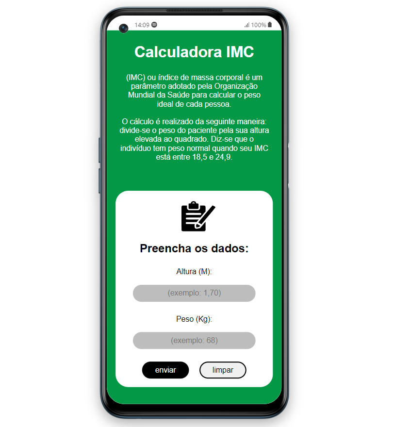

# Introdução

Este projeto é uma calculadora IMC (Índice De Massa Corporal) criada com HTML, JavaScript e CSS como parte do aprendizado dessas tecnologias.

## 👀 Ver projeto

Acesse o link [aqui](https://brenolira01.github.io/Calculadora-IMC/).

## 🧠 Tecnologias Utilizadas

  

## 🔍 Fontes

Os elementos adicionados ou modificados neste projeto foram obtidos de diversas fontes. Abaixo está a lista de onde cada elemento foi encontrado:

- **Imagem de background**: <a href="https://unsplash.com/pt-br/@visualsbyroyalz?utm_content=creditCopyText&utm_medium=referral&utm_source=unsplash">Anastase Maragos</a> na <a href="https://unsplash.com/pt-br/fotografias/mulher-em-regata-preta-e-shorts-vermelhos-fazendo-exercicio-4dlhin0ghOk?utm_content=creditCopyText&utm_medium=referral&utm_source=unsplash">Unsplash</a>
- **Ícone de prancheta**: Fonte: <a href="https://www.flaticon.com/br/icones-gratis/prancheta" title="prancheta ícones">Prancheta ícones criados por Freepik - Flaticon</a>
- **Ícone de github**: Fonte: <a href="https://www.flaticon.com/br/icones-gratis/github" title="github ícones">Github ícones criados por Pixel perfect - Flaticon</a>
- **Ícone de linkedin**: Fonte: <a href="https://www.flaticon.com/br/icones-gratis/linkedin" title="linkedin ícones">Linkedin ícones criados por Freepik - Flaticon</a>

Agradeço aos criadores originais por disponibilizarem esses recursos.

## 🌱 Contribuições

Contribuições são bem-vindas! Sinta-se à vontade para abrir problemas e solicitações de pull para melhorar este projeto.

## Autor

Feito por [Francisco Breno](https://www.linkedin.com/in/breno-lira-perfil).

## 📫 Contato

## 📄 Licença

Este projeto é licenciado sob os termos da [Licença MIT](/LICENSE.txt).
Leia o arquivo [LICENSE](/LICENSE.txt) para obter mais detalhes sobre as permissões e restrições da Licença MIT.
