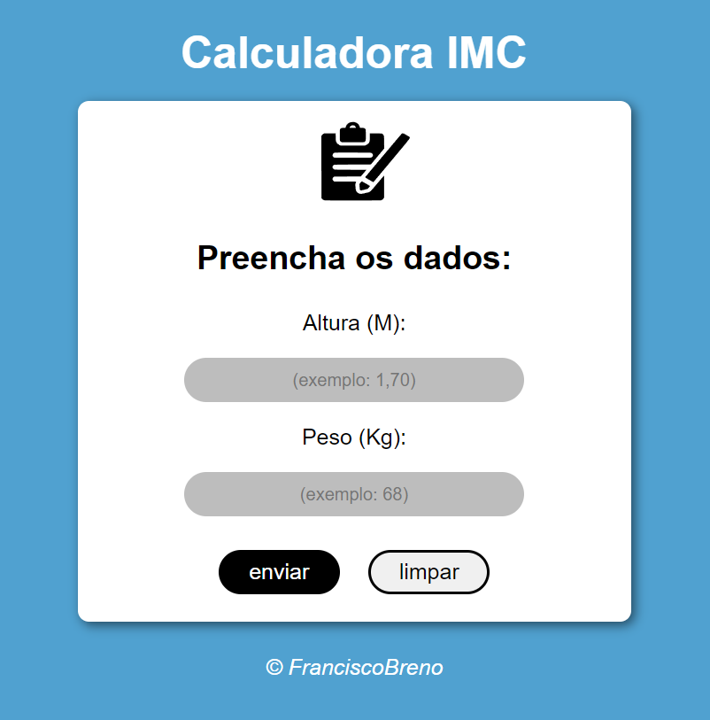

# Introdução

Este projeto é uma calculadora IMC (Índice De Massa Corporal) criada com HTML, JavaScript e CSS como parte do aprendizado dessas tecnologias.

Clique [aqui](https://brenolira01.github.io/Calculadora-IMC/) para ver o projeto.

## Tecnologias Utilizadas

  

## Fontes

Os elementos adicionados ou modificados neste projeto foram obtidos de diversas fontes. Abaixo está a lista de onde cada elemento foi encontrado:

- **Ícone de prancheta**: Fonte: <a href="https://www.flaticon.com/br/icones-gratis/prancheta" title="prancheta ícones">Prancheta ícones criados por Freepik - Flaticon</a>

Agradeço ao criador original por disponibilizar esse recurso.

## Contribuições

Contribuições são bem-vindas! Sinta-se à vontade para abrir problemas e solicitações de pull para melhorar este projeto.

## Contato

- [Email](mailto:franciscobrenolira@gmail.com)

## Licença

Este projeto é licenciado sob os termos da [Licença MIT](/LICENSE.txt).
Leia o arquivo [LICENSE](/LICENSE.txt) para obter mais detalhes sobre as permissões e restrições da Licença MIT.
